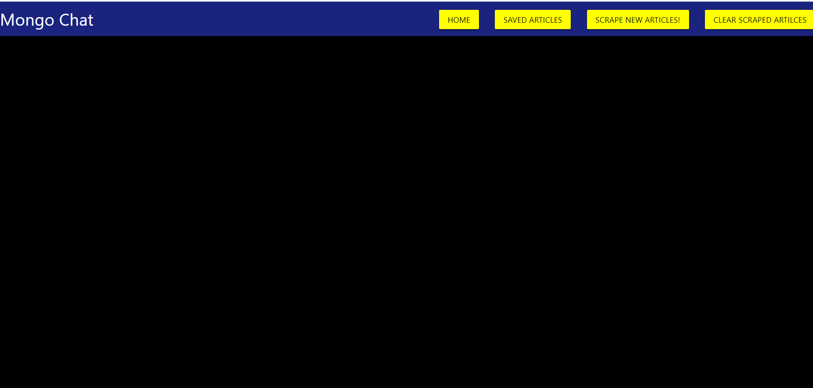
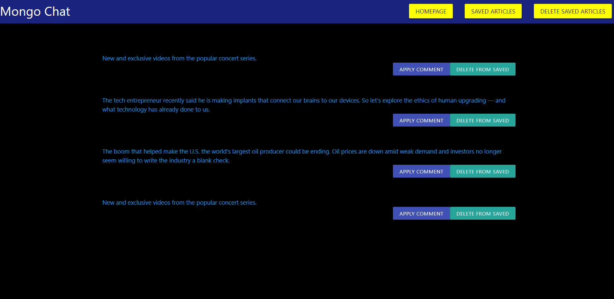

<<<<<<< HEAD
## MongoChat
This App Lets Users Leave Comments and read material from various news sites. It scrapes targeted content
from news outlets and display them to the client. It also, simultaneously stores information in the noSQL
Mongo database for future reference.

test out the website [here](https://warm-meadow-54505.herokuapp.com/)

## Demonstration of Website Features

This is an image of the homepage:

This is an image of scraped artices:

This is an image of saved articles:

### Technologies Used

 ###### NPM Packages

   1. express

   2. express-handlebars

   3. mongoose

   4. cheerio

   5. axios

###### Database
 1. Mongo

